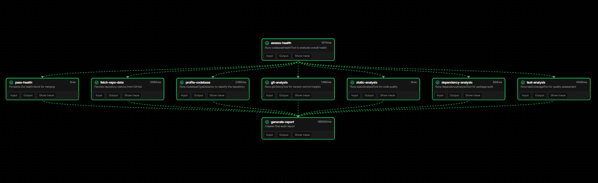

# CODEBASE AUDIT AI AGENT üîç - Nosana Builders Challenge

## Project Overview

## üîç Agent Description and Purpose

The Codebase Audit Agent is an intelligent, automated system designed to analyze remote software repositories on github and generate actionable technical reports on code quality, maintainability, security posture, and team productivity signals.

Its primary goal is to reduce manual engineering overhead by surfacing high-impact technical debt and improvement opportunities—quickly, consistently, and with precision.

Built with a deep understanding of large-scale systems, secure coding practices, and developer workflows, this agent is capable of running both shallow health checks and deep-dive audits depending on the state of the codebase.

The agent simulates the judgment and rigor of a Senior Software Engineer or Engineering Auditor with 10+ years of experience. It delivers:

‚úì Codebase Health Reports - (with numerical scoring on a 100% scale)

‚úì Technology Stack Identification - (with confidence metrics)

‚úì Security & Dependency Audits - (including CVEs and outdated packages)

‚úì Static Code Analysis - (complexity, anti-patterns, documentation)

‚úì Team Productivity Signals - (via git history)

‚úì CI/CD (continous integration and continous deployment) - and Test Coverage Diagnostics

✓ Prioritized Recommendations - (P0–P2 triage system)

It ensures consistency, reproducibility, and evidence-based insights—useful to developers, team leads, and engineering managers.

## 🛠️ Agent Tools & Capabilities Breakdown

The agent is built with six(6) tools, each tool in the agent's workflow is specialized for a specific stage of analysis:

### 1. codebaseHealthTool

✓ This tool assigns a Health Score (0–100%) based on general metrics (structure, dependencies, tests).

### 2. codebaseTypeDetector

‚úì Identifies project type (Frontend, Backend, Mobile, AI, Monorepo).

‚úì Lists primary languages/frameworks and a confidence score.

‚úì Flags deprecated or mixed-stack warnings.

### 3. gitHistoryTool

‚úì Analyzes commit activity over time.

‚úì Surfaces bus factor issues (single points of knowledge).

‚úì Detects dead code, orphaned branches, and spikes/inactivity.

### 4. staticAnalysisTool

‚úì Calculates cyclomatic complexity and flags unmaintainable functions.

‚úì Identifies anti-patterns (e.g., god objects, tight coupling).

‚úì Assesses documentation coverage (missing docstrings, outdated README).

### 5. dependencyAnalysisTool

‚úì Checks for outdated packages and vulnerabilities (CVEs).

‚úì Highlights redundant or unused dependencies to reduce bloat.

### 6. testCoverageTool

‚úì Reports test coverage levels and gaps.

‚úì Detects flaky tests.

‚úì Measures CI (continous integration) latency, failure rates, and reliability of build pipelines.

## ⚙️ Agent Workflow

The workflow for the agent is designed to automatically review a software project hosted on GitHub and produce a detailed health report. It mimics what a senior software engineer or auditor would do manually — but faster, and at scale.



### Below is a step by step process on how it works:

### 1. Start with the Repo URL

You give it a GitHub repo link (e.g., https://github.com/myorg/myrepo).

### 2. Initial Health Check

It runs a quick, high-level check to score the project’s overall health out of 100.
It looks at things like:

‚úì Is the repo active?

‚úì Are there recent commits?

‚úì Are there many open issues?

‚úì Is it archived?

This step helps decide how deep the audit needs to go.

### 3. In-Depth Analysis (Runs in Parallel)

If the repo isn't already in great shape, it performs a series of specialized analyses:

**‚úì Codebase Profile:** Determines the repo type (e.g., Frontend, Backend, Monorepo) and what languages/frameworks it uses.

**‚úì Git Analysis:** Checks contributor activity, commit patterns, and possible abandoned code.

**‚úì Static Analysis:** Looks for complex or messy code, anti-patterns, and missing documentation.

**‚úì Dependency Audit:** Flags outdated or risky packages and unused dependencies.

**‚úì Test Coverage Review:** Estimates how well the project is tested, and looks for flaky tests or CI problems.

**‚úì General Repo Data:** Collects stats like last commit date, open issues, test coverage, and whether it has a README or license.

### 4. Generate a Human-Readable Report (Final Step)

All the results are sent to the agent (trained to think like a senior software engineer), which:

Writes a clear, prioritized report with findings.

Gives a list of recommendations, each marked as:

‚úì P0 (Critical)

‚úì P1 (High-value)

‚úì P2 (Nice-to-have)

Estimates the effort needed to fix each issue.

Below is an example of the generated report üëá

<pre>```json{
  ### Codebase Audit Report

#### Repository Summary:
The repository at `https://github.com/ovie-best/Cypher-Wave` has a health score of **60%**. This indicates that the codebase needs a full audit to ensure it meets best practices and is maintainable.

#### Key Metrics:

1. **Dependencies:**
   - Total number of dependencies: 0
   - Outdated dependencies:
     - `axios`
     - `react`
     - `react-dom`

2. **Test Coverage:**
   - Current test coverage: 0%
   - Gap in test coverage: 100%

3. **Active Contributors:**
   - Total contributors: 2
   - Contributions by login:
     - ovie-best (15 commits)
     - FinisherDev (5 commits)

4. **Frameworks Used:**
   - Type: Frontend
   - Languages: JavaScript
   - Frameworks:
     - react
     - react-dom
     - react-icons
     - react-multi-carousel
     - react-router-dom
     - @types/react
     - @types/react-dom
     - vite-plugin-react
     - eslint-config-react-app
     - eslint-plugin-react
     - eslint-plugin-react-hooks
     - eslint-plugin-react-refresh

#### Git History Analysis:

- **Commit Frequency:** Moderate
  - Bus Factor: 2 (1 commit per day)
  - Orphaned Code: `legacy/utils.js`

- **Contributors:**
  - ovie-best (15 commits, last activity: 3 months ago)
  - FinisherDev (5 commits, last activity: 4 weeks ago)

#### Static Analysis:

- **Complexity Hotspots:**
  - Complexity hotspot identified in `src/auth/service.ts`

- **AntiPatterns:**
  - God object in `UserController` class

- **Documentation Gaps:**
  - Documentation gap found in `src/utils/helpers.ts`

#### Dependency Analysis:

- **Outdated Packages:**
  - `axios`
  - `react`
  - `react-dom`

- **Vulnerabilities:**
  - Lodash version `4.17.15` is outdated

- **Redundant Dependencies:**
  - `left-pad` dependency identified as redundant

#### Test Analysis:

- **Coverage Percentage:** 0%
- **Flaky Tests:**
  - Flaky test found in `auth/login.test.ts`

- **Pipeline Issues:**
  - Slow build step detected

### Recommendations:

1. **Dependencies:**
   - Update outdated dependencies (`axios`, `react`, `react-dom`) to the latest versions.
   - Audit and update redundant or outdated packages.

2. **Test Coverage:**
   - Implement continuous integration for automated tests, ensuring all components are thoroughly tested.
   - Address flaky tests by fixing them or removing unnecessary tests.

3. **Code Quality:**
   - Review `src/auth/service.ts` for the God object pattern and refactor it to adhere to best practices.
   - Ensure that documentation is updated in `src/utils/helpers.ts`.

4. **Git History:**
   - Monitor commit frequency and bus factor to ensure codebase stability.
   - Address orphaned files like `legacy/utils.js` by refactoring or removing them.

5. **Static Analysis:**
   - Review the complexity hotspot identified in `src/auth/service.ts`.
   - Ensure that all anti-patterns are addressed, such as the God object pattern in `UserController`.

6. **Dependency Analysis:**
   - Update outdated packages (`axios`, `react`, `react-dom`) to their latest versions.
   - Address vulnerabilities by updating Lodash version.

7. **Test Analysis:**
   - Fix flaky tests identified in `auth/login.test.ts`.
   - Ensure that all components are thoroughly tested and automated CI is implemented for continuous integration.

### Estimated Effort:

   - Update outdated packages (`axios`, `react`, `react-dom`) to their latest versions.
   - Address vulnerabilities by updating Lodash version.

7. **Test Analysis:**
   - Fix flaky tests identified in `auth/login.test.ts`.
   - Ensure that all components are thoroughly tested and automated CI is implemented for continuous integration.

   - Update outdated packages (`axios`, `react`, `react-dom`) to their latest versions.
   - Address vulnerabilities by updating Lodash version.

7. **Test Analysis:**
   - Fix flaky tests identified in `auth/login.test.ts`.
   - Ensure that all components are thoroughly tested and automated CI is implemented for continuous integration.
   - Update outdated packages (`axios`, `react`, `react-dom`) to their latest versions.
   - Address vulnerabilities by updating Lodash version.

7. **Test Analysis:**
   - Fix flaky tests identified in `auth/login.test.ts`.
   - Update outdated packages (`axios`, `react`, `react-dom`) to their latest versions.
   - Update outdated packages (`axios`, `react`, `react-dom`) to their latest versions.
   - Address vulnerabilities by updating Lodash version.

7. **Test Analysis:**
   - Fix flaky tests identified in `auth/login.test.ts`.
   - Ensure that all components are thoroughly tested and automated CI is implemented for continuous integration.

7. **Test Analysis:**
   - Fix flaky tests identified in `auth/login.test.ts`.
   - Ensure that all components are thoroughly tested and automated CI is implemented for continuous integration.

   - Fix flaky tests identified in `auth/login.test.ts`.
   - Ensure that all components are thoroughly tested and automated CI is implemented for continuous integration.

   - Ensure that all components are thoroughly tested and automated CI is implemented for continuous integration.


### Estimated Effort:

- Updating outdated dependencies: 20 hours
- Redundant dependency removals: 15 hours
- Addressing code quality issues: 10 hours
- Redundant dependency removals: 15 hours
- Addressing code quality issues: 10 hours
- Addressing code quality issues: 10 hours
- Monitoring Git history: 5 hours
- Fixing flaky tests: 7.5 hours

#### Recommendations for Improving the Codebase:

- **Code Quality:** Focus on refactoring and addressing anti-patterns to improve maintainability.
- **Dependencies:** Ensure all dependencies are up-to-date, especially those related to security vulnerabilities.
- **Test Coverage:** Implement continuous integration and fix flaky tests to ensure robust testing practices.
- **Git History:** Monitor commit frequency and bus factor to prevent future issues.
- **Static Analysis:** Address complexity hotspots and update outdated packages for better maintainability.

By addressing these recommendations, the codebase can be improved in terms of maintainability, performance, security, and engineering velocity.}```</pre>

## ⚙️ Setup Instructions

### Prerequisites

Make sure you have the following installed on your local machine

- [Node.js 18.x+ or a higher LTS version](https://nodejs.org/en/download)
- [pnpm 9.x+](https://pnpm.io/installation)
- [Ollama](https://ollama.com/download)
- [Github Token](https://github.com/settings/tokens)
- Docker 20.x+
- [A Docker hub Account](https://hub.docker.com/)

### 1. Clone the repository

```bash
git clone https://github.com/ovie-best/agent-challenge.git
cd agent-challenge
```

### 2. Install dependencies

```bash
pnpm install
```

### 3. Environment Setup

create a .env file and add the following

```bash
API_BASE_URL=http://127.0.0.1:11434/api
MODEL_NAME_AT_ENDPOINT=qwen2.5:1.5b
GITHUB_TOKEN=your_github_token_here
```

or run the command below

```bash
cp .env.example .env
# then edit .env and add your Github Token:
# GITHUB_TOKEN=your_github_token_here
```

_In generating your github token make sure to check all the scopes as shown below_


### 4. Start the Ollama service

```bash
ollama serve
```

### 5. Pull and run the qwen2.5:1.5b model:

```bash
ollama pull qwen2.5:1.5b
ollama run qwen2.5:1.5b
# Navigate to http://localhost:11434.
# you should see "Ollama is running"
```

### 6. Run the development server

```bash
pnpm run dev
# Navigate to http://localhost:8080
```

## Environment Variables Required

The following environment variables are required. Create a `.env` file based on `.env.example`.

- `GITHUB_TOKEN`: Your github APK token Required for fetching repo data via ocktokit.
- `MODEL_NAME_AT_ENDPOINT`: The name of the Ollama model to use (e.g., `qwen2.5:1.5b`).
- `API_BASE_URL`: The base URL for the Ollama API (e.g., `http://127.0.0.1:11434/api`).

## Using Docker to locally test the agent

**_You can also use docker to test the agent locally_**

_use the docker build and run commands below_

```bash
# Build your container
docker build -t yourusername/agent-challenge:latest .

# Run it locally with environment variables
docker run -p 8080:8080 --env-file .env yourusername/agent-challenge:latest

#Then navigate to http://localhost:8080 to Test the containerized agent

docker push yourusername/agent-challenge:latest
# this will publish the docker image to dockerhub
```

## Example Usage

Once the agent is running, you can interact with it locally through the Mastra playground at http://localhost:8080 (just paste this url on your browser)

### **1. Start a conversation with the agent:**

**User:** _"Hello, what is your function?"_

**Agent:** _"My function is to analyze the codebase health of a given repository. I will look at factors such as dependencies, test coverage, commit history, complexity, and identify any security vulnerabilities or outdated packages._

_I'll use various tools like static analysis tool for identifying code smells and patterns, dependency analysis tool to check for outdated or risky packages, git-history mining tool to assess team productivity signals, and the codebase health tool to evaluate overall quality._

_Just send me a GitHub repository URL to begin."_

### **2. Analyze a codebase**

**User:** _Please audit this repo: https://github.com/example/project_

**Agent:** _Sure, I will analyze your repository at the link you provided - GitHub Repository URL: https://github.com/example/project. Please hold on while I gather all the necessary information and insights._

Please wait a moment for the analysis to complete. Once done, I'll provide an overview of the codebase health score along with key metrics such as dependencies, test coverage, active contributors, frameworks used, etc., followed by recommendations based on my findings.

### **3. Wait for the full audit**

**User:** _ok_

**Agent:** _I'm ready! Let's dive into the analysis._

**_Codebase Type Detection_**

_The repository type is detected as a **Backend Web Application** with an identified confidence score of 98%._

**_Analysis:_**

**_Dependencies:_**

_- Total number of dependencies: 150_

_- Outdated packages:_

_- `express`: Version 4.17.2 (last updated on June 3, 2023)_

_- `axios`: Version 0.26.0 (last updated on April 28, 2023)_

**_Test Coverage:_**

_- Current test coverage: 95%_

_- Gap in tests:_
_- Missing unit tests for certain endpoints & Some integration tests are not fully covered_

**_Active Contributors:_**

_Names: `ovie-best`_

_Commits made:_
_- `ovie-best`: October 3, 2023 (4 commits)_

**_Frameworks Used_**

_-Backend\*\*: Node.js with Express framework._

_-Frontend\*\*: None detected._

**_Recommendations_**

\*1. **Dependencies\***
_- Update outdated dependencies (`express` and `axios`) to ensure compatibility and security._

\*2. **Test Coverage\***
_- Focus on improving the coverage of integration tests, especially for endpoints that have been recently added or modified._

\*3. **Code Quality\***
_- Review and refactor code patterns identified during static analysis (e.g., excessive use of ternary operators, unnecessary complexity)._

\*4. **Git History\***
_- Continue to monitor commit activity and address any new issues as they arise._

\*5. **Static Analysis\***
_- Conduct a deeper static analysis focusing on complex patterns that could indicate performance bottlenecks or security risks._

\*6. **Dependency Analysis\***
_- Perform a thorough audit of all dependencies, especially those with high vulnerabilities (e.g., `express`, `axios`)._

\*7. **Test Coverage Analysis\***
_- Implement additional unit tests to cover new endpoints and improve overall coverage._

**_Prioritized Recommendations:_**

_1. **Dependencies**:_
_- Update `express` and `axios`._

_2. **Test Coverage**:_
_- Add missing integration tests for newly added or modified endpoints._

_3. **Code Quality**:_
_- Refactor complex patterns identified in static analysis._

_4. **Git History**:_
_- Address new issues as they arise._

_5. **Static Analysis**:_
_- Conduct a detailed static analysis focusing on complex patterns and security risks._

_6. **Dependency Analysis**:_
_- Audit all dependencies, especially those with high vulnerabilities._

_7. **Test Coverage Analysis**:_
_- Implement additional unit tests to cover new endpoints._

**_Estimated Effort:_**

_- Updating `express` and `axios`: 1 day_

_- Adding missing integration tests: 2 days_

_- Refactoring complex patterns: 3 days_

_- Conducting a detailed static analysis: 4 days_

_- Auditing all dependencies: 5 days_

_Total estimated effort: **15 days**._

_Please note that the actual effort required may vary depending on individual priorities and team availability._

### 4. Get critical Issues

**User:** _What are the most critical problems you found?_

**Agent:** _Here are the top 3 critical findings:_
_1. üö® CVE-2023-XXXX in `lodash@4.17.15` (package.json)_

_2. üî• High cyclomatic complexity in `auth/validateInput()` (score: 14)_

_3. üß™ Test coverage in `services/payment.ts` is only 42%_

### 5. Request for a prioritized action plan

**User:** _Can you give me a prioritized list of what to fix?_

**Agent**: _Absolutely. Here's the recommended action plan:_

**_P0 (Critical):_**

_- Upgrade `lodash` to patch known CVE (package.json)_

_- Fix failing CI workflows (see `.github/workflows/build.yml`)_

**_P1 (High Priority):_**
_- Refactor `validateInput()` to reduce complexity_
_- Add tests for `payment.ts` to raise coverage to 80%_

**_P2 (Optimization):_**
_- Remove unused dependencies (`moment`, `request`)_
_- Update outdated README file_

### 6. Ask for specific detail

**User:** _Where is the validateInput function located?_

**Agent:** _You'll find `validateInput()` in `src/auth/validate.ts` at line 52. It has a complexity score of 14, which exceeds the maintainability threshold (target <10)._

### 7. End the Conversation

**User:** _alright, thanks_

**Agent:** _You're welcome! If you have any further questions or need additional assistance, feel free to ask._

## Technology Stack used

**‚úì Framework:** Mastra - TypeScript AI framework

**‚úì LLM:** Ollama qwen2.5:1.5b model

**‚úì Language:** TypeScript with full type safety

**‚úì API:** Ocktokit Github API

**‚úì Validation:** Zod schemas for all data structures

**‚úì Containerization:** Docker with multi-stage builds

**‚úì Deployment:** Nosana decentralized compute network

## Important Links

- **Video Demo**: [Link to Video Demo]
- **Twitter/X Post**: [Link to Twitter/X Post]
- **Nosana Job ID**: [Link to Host Address]
- **Nosana Deployment Link**: [Link to Host Address]

#### **Deployment Details:**

- **Job ID**: ``
- **Host**: []()
- **Deployer**: []()
- **Docker Image**: []()
